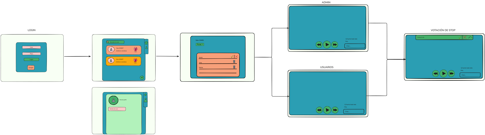

# PartyView

Frontend:

Backend: 
Hay un script llamado gestionSalas, el cual ejecuta el script de pyton llamado main.py en el archivo de proyecto GestionSalas, este script permite añadir, modificar y eliminar la informacion de la bd respecto a las salas y los usuarios que hay en ella.